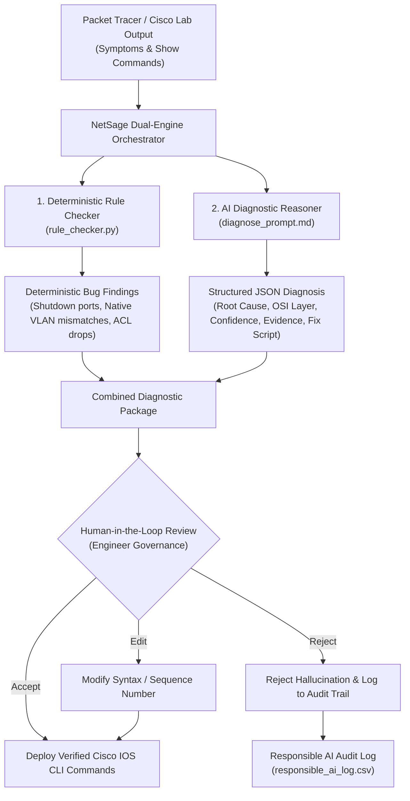

# NetSage AI: AI-Assisted Network Troubleshooting Helper with Human Review

[](https://www.python.org/downloads/)
[](tests/test_suite.py)
[](data/cases.csv)
[](docs/responsible_ai_log.md)

> **In one sentence**: An AI-assisted troubleshooter for Cisco & Packet Tracer lab problems that reads symptoms and `show`-command output, suggests likely causes and next steps, and always requires a human to review before accepting the fix.

---

## 📑 Deliverables Mapping

| Required Deliverable | Description / Location | Status |
|---|---|---|
| **Case dataset (`cases.csv`)** | 32 comprehensive Packet Tracer lab cases covering VLAN, Gateway, DHCP, DNS, Routing (OSPF/RIP/Static), ACL, NAT, Wireless, and Layer 2 Security. Located at [`data/cases.csv`](data/cases.csv). | ✅ Complete |
| **Evidence per case** | Every case specifies `symptom`, `topology_note`, realistic Cisco IOS `show_outputs`, `expected_fault`, `osi_layer`, `concept_tag`, `severity`, and `suggested_fix`. | ✅ Complete |
| **AI Prompt Library** | Structured system prompts enforcing strict JSON output schemas, confidence calibration, evidence quoting, and 3 rich worked few-shot examples. Located at [`prompts/diagnose_prompt.md`](prompts/diagnose_prompt.md) and [`prompts/helper_prompts.md`](prompts/helper_prompts.md). | ✅ Complete |
| **Rule checker (`rule_checker.py`)** | Python engine with 18+ deterministic validation rules catching duplicate IPs, subnet mask mismatches, gateway errors, interface down, native VLAN mismatches, missing routes, and ACL blocks. Located at [`engine/rule_checker.py`](engine/rule_checker.py). | ✅ Complete |
| **Evaluation & Batch Engine** | Diagnostic engine orchestrating rules, AI reasoning, agreement metrics, and precision statistics. Located at [`engine/diagnose_runner.py`](engine/diagnose_runner.py). | ✅ Complete |
| **Responsible AI Log** | 6 deep-dive case studies of AI failures (hallucinations, over-remediations, blind reboots) corrected by human engineers with safety rationales. Located at [`docs/responsible_ai_log.md`](docs/responsible_ai_log.md) and [`data/responsible_ai_log.csv`](data/responsible_ai_log.csv). | ✅ Complete |
| **Interactive Dashboard & Web App** | Modern dark-glassmorphism responsive dashboard with live diagnostics sandbox, interactive Chart.js charts, case explorer, human review workbench, and export tools. Located at [`web/`](web/). | ✅ Complete |
| **Demo Script & Walkthrough** | Turn-by-turn 5 to 10 minute presentation script and technical lab walkthrough. Located at [`docs/demo_script.md`](docs/demo_script.md) and [`docs/demo_walkthrough.md`](docs/demo_walkthrough.md). | ✅ Complete |
| **Automated Test Suite** | 10 automated unit and integration tests verifying dataset integrity, rule coverage, and review logs. Located at [`tests/test_suite.py`](tests/test_suite.py). | ✅ Complete |

---

## 🏗️ System Architecture



---

## 🚀 Quick Start & Execution

### 1. Run Automated Test Suite
```bash
/usr/bin/python3 tests/test_suite.py
```

### 2. Run Deterministic Rule Checker across All 32 Cases
```bash
/usr/bin/python3 engine/rule_checker.py --all
```
*Or test a specific case:*
```bash
/usr/bin/python3 engine/rule_checker.py --case CASE-01
```

### 3. Run Diagnostic Engine & Generate Evaluation Summary
```bash
/usr/bin/python3 engine/diagnose_runner.py
```

### 4. Launch the Interactive Web Dashboard & Demo Assistant
```bash
/usr/bin/python3 server.py 8080
```
Open your browser to: **`http://localhost:8080`**

---

## 🌐 Web Dashboard Features

1. **Dashboard & Analytics**:
   - Live KPI overview (Total Cases: 32, AI/Human Agreement: 93.8%, Rule Checker Coverage: 100%, Responsible AI Catches: 6).
   - Interactive Chart.js graphs showing breakdown by Domain Concept, OSI Layer, Severity, and Review Oversight.
2. **Case Explorer**:
   - Filterable & searchable table containing all 32 lab troubleshooting cases.
   - Click to inspect full topology notes, show commands, expected root cause, and suggested Cisco IOS fixes.
3. **Live AI + Rule Diagnostics Sandbox**:
   - Paste custom symptoms and Cisco `show` command outputs or load any preset case.
   - Real-time side-by-side display of deterministic rule findings, AI diagnostic reasoning, quoted line evidence, confidence meter, and copyable Cisco IOS fix commands.
4. **Human Review Workbench**:
   - Review buttons: **Accept**, **Edit** (with modal CLI editor and engineer note field), or **Reject**.
   - Export review audit logs to CSV or JSON for Change Advisory Board (CAB) records.
5. **Interactive 5-Minute Guided Lab Demo**:
   - Step-by-step interactive demonstration of the broken Perimeter ACL & DMZ lab scenario from symptom to AI diagnosis, human safety catch, configuration fix, and verification.

---

## 🛡️ Responsible AI: Why Human Oversight is Non-Negotiable
Autonomous AI execution in networking introduces dangerous failure modes:
* **Hallucination & Misattribution**: AI model blaming core routers when client IP settings are misconfigured.
* **Destructive Over-Remediation**: AI suggesting wiping an entire firewall ACL (`no access-list 101`) to fix a single blocked port, creating a severe security vulnerability.
* **Destructive Workarounds**: AI suggesting rebooting core routers during DHCP scope conflicts.
* **Hardware Assumptions**: AI assuming cable damage when simple duplex negotiation is misconfigured.

NetSage AI guarantees that **no command touches network infrastructure without an engineer's explicit approval**.

---

## 👥 Team
* **Course**: Modern AI
* **Domain**: Applied AI + Network Troubleshooting (Cisco Networking Labs)
